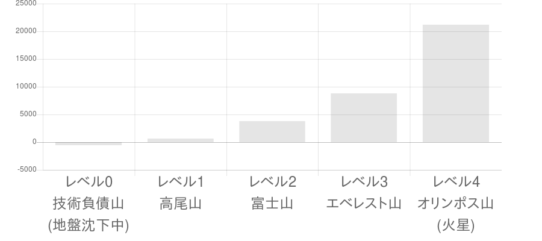

# 意識の低いSRE SREに取り組む前の話

## 前置き

|目標レベル|レベル0 技術負債山 (地盤沈下中)|レベル1 高尾山|レベル2　　　 富士山|レベル3　　　 エベレスト山|レベル4　　　 オリンポス山 (火星)|
|---|---|---|---|---|---|
|段階|オンプレで LAMP構成|クラウド化|マイクロサービス化|パブリッククラウド フル活用|世界中に 自社データセンターや 海底ケーブル|
|例|10年前に 作った システムのまま|ここ数年で 作った システム|2014年の クックパッドの 報告が有名|Netflix, Pokemon GO, ...|Amazon, Microsoft, Google, facebook, ...|

レベル０のプロジェクトを、レベル２に持って行くには、まずレベル１をクリアする必要がありますよね、の話です。

オンプレでLAMP構成な人向けです。

## 本題

### １．あなたのプロジェクトは、どのレベルにありますか？

|SREで捨てるもの|SREで取り入れるもの|
|---|---|
|ウォーターフォール|アジャイル|
|片手間に改善|開発作業の半分は改善|
|オンプレ|クラウド|
|XX専用サーバ、KVM|docker|
|サーバのupdate|サーバは使い捨て(式年遷宮/Blue-Green Deployment)|
|Apache|Nginx|
|php 5.4|php 7.x|
|MySQL 5.5/MariaDB 5.5|MySQL 5.7/MariaDB 10.x|
|手動デプロイ|自動デプロイ|
|subversion|git|
|手動テスト|自動テスト|
|モノシリックなシステム|マイクロサービス|
|ぐだぐだなセキュリティ体制|PCI DSS準拠のセキュリティ体制|
|共有ID/パスワード|個人別ID/パスワード|
|思い込みで作業順を決める|計測結果で作業順を決める|
|...|...|

2017-08-24 [「hbstudy＃76 SRE大全: XFLAG スタジオ編」で発表しました](https://xflag.com/blog/hbstudy76_sre_xflag.html)
で、「**SREとは、確実に古いシステムを捨てていく事**」という名言がありました。

### ２．より深刻な問題は何ですか？

[80対20の法則](https://www.amazon.co.jp/dp/B00CPKUY7C) 等で言われているように、より深刻な20%の問題から取り組みましょう。  
残り80%は当面現状維持、後回しで良いのです。

大部分のプロジェクトでは、

- セキュリティ問題
- 負荷上限が低い
- 冗長化が無い（不足）

が３大問題で、あとは小さな問題(フレームワーク使ってない、とか)の可能性が高いです。

### ３．作業順

レベル０をレベル１にする時の作業順です。

1. 右から左（シフト＆リフト）でクラウドに持っていく
1. 深刻な不足リソース(CPU,memory,disk等)は増やす
1. docker化する（これで、php5.4/php7.xの複数バージョン共存が可能になる）
1. OS,php,MySQL等を最新にする(セキュリティ)

いわゆる普通の「クラウド移行案件」って感じですね。

### ４．その後の作業見通し

レベル１をレベル２にする時の作業順です。

1. ソースコードをgit管理する
1. CIツールを導入する
1. CIツールの制約に合わせた形で自動デプロイ化する
1. 自動テストを作成する
1. CIツールで自動テストが動くようにする
1. ログサーバ作る
1. ログをfluentdでnginx→ログサーバ→bigquery転送する
1. BIツール入れる
1. BIツールの使い方を研究する（遅い箇所の探し方）

## 結論

SREに取り組む前に、まずクラウド化してくださいねー
